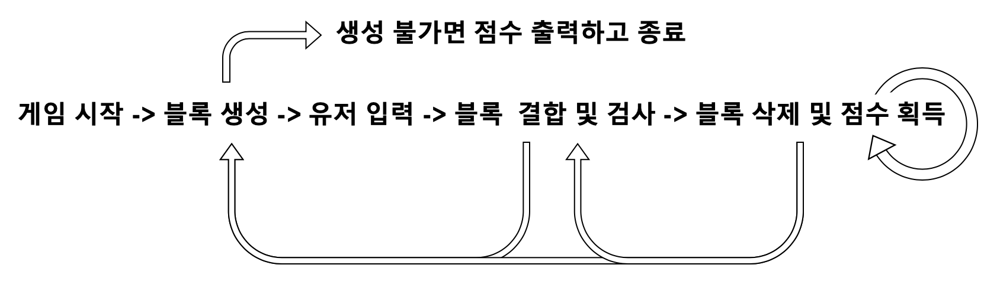
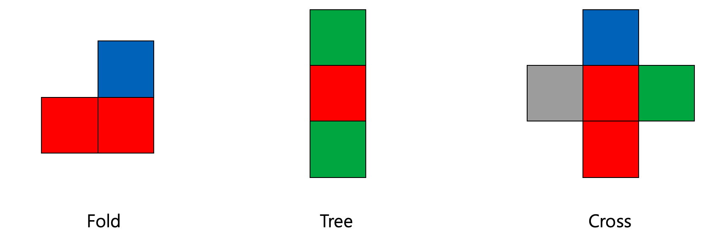

# ぷよぷよ(PuyoPuyo) Game
- ## 개요
  1991, 1992년에 처음 나온 낙하물 퍼즐류의 퍼즐 게임을 모티브로 변형된 내용을 구현
- ## 개발환경 및 도구
  Ubuntu 18.04 / vim editor / g++ (Ubuntu 7.4.0 - 1ubuntu1 ~ 18.04.1) 7.4.0
- ## 개발내용
  아래와 같은 동작의 흐름을 가지도록 하여 ぷよぷよ GAME의 변형된 모델을 개발
  
  
  
  또한 게임에서 생성되는 block의 종류는 아래의 3가지로 제한
  
  
